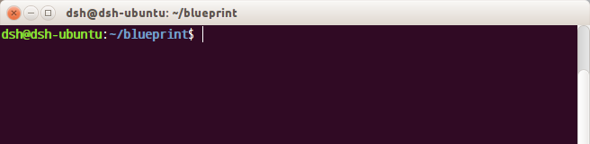
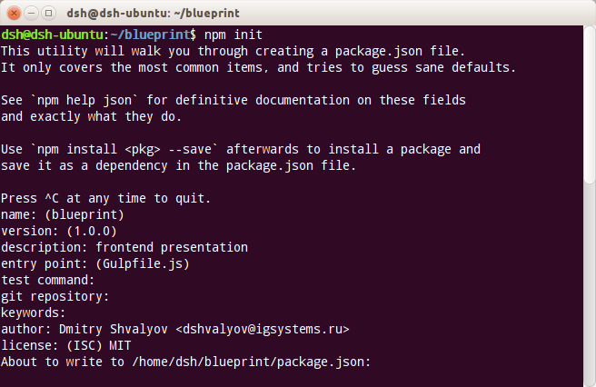
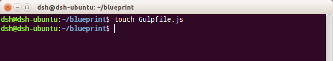
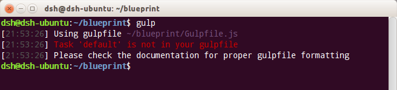

## Введение

**Node.js** (Node)

> Node не является сервером, это платформа на движке V8 (транслятор javascript в машинный код) предоставляющая доступ к низкоуровневым устройствам ввода-вывода для javascript через свой API. <sup>[1]</sup> <sup>[2]</sup>

**npm** - Менеджер сторонних пакетов. Входит в дистрибутив Node

> Главной частью экосистемы Node являются пакеты (javascript приложения со своим API). Пакеты могут зависеть друг от друга и задача npm не только установить пакеты, но и решить их рекурсивные зависимости и коллизии

> Любой желающий может создать и поделиться своим node-пакетом через npm, что делает экосистему всё больше и больше. На сегодняшний момент уже больше 104 тыс. доступных пакетов. <sup>[3]</sup> <sup>[4]</sup>

?? Unix-way работа в консоли



## Инициализация

> Для Node любой проект является пакетом поэтому начало работы идёт с его описания в файле ``package.json``. Его можно создать вручую или ответив на несколько вопросов запустив команду:

``npm init``



> Название пакета, версия, описание, ссылка на репозиторий, авторство и лицензия

> При этом в секцию ``dependencies`` пропишутся уже локально установленные пакеты <sup>[5]</sup> <sup>[6]</sup> <sup>[7]</sup>

## Работа с пакетами

### Установка пакетов вручную

``npm install <имя_пакета>`` или сокращенно ``npm i <имя_пакета>``

##### Флаги:
* ``-g`` -  устанавливаем пакет глобально (для вызова из командной строки)
* ``-save`` - сохраняем имя пакета в секцию dependencies файла package.json
* ``-save-dev`` - сохраняем имя пакета в секцию devDependencies файла package.json

> В секцию devDependencies прописываются пакеты участвующие при разработке проекта (тестирование, линтинг, минимизирование, компиляция). В dependencies - пакеты непосредственно подключаемые при работе пакета <sup>[8]</sup>

> По-умолчанию пакет устанавливается в папку node_modules разрабатываемого пакета. Если у устанавливаемого пакета есть свои зависимости они тоже устанавливаются в папку node_modules в корне самого пакета (рекурсивная зависимость)

> **Важно!**
> Некоторые пакеты используются в командной строке (CLI: Command-line interface) в любой директории, для этого они должны быть установлены глобально (с флагом -g) и путь их установки должен быть прописан в переменной окружения PATH

### Автоматическая установка пакетов

``npm install`` или сокращенно ``npm i`` при наличии прописанных пакетов в секции dependencies и в devDependencies файла package.json

При установке пакета на продакшн командой ``npm install --production`` или сокращенно ``npm i --production`` пакеты из секции devDependencies установлены не будут <sup>[8]</sup>

## Пакеты для сборки

### Gulp.js

``npm install -g gulp``

``npm install gulp --save-dev``

> Gulp.js (Gulp) - потоковый менеджер задач (task runner) для сборки проектов

> Gulp - Node пакет работающий в командной строке (CLI) и предоставляющий интерфейс для поочередного запуска других пакетов, работы с файлами и каталогами через маски

#### Gulpfile.js

> Gulpfile - javascript файл описывающий подключение пакетов, задачи gulp и при необходимости сервисные функции. <sup>[9]</sup>

> Gulpfile создаётся в корне проекта

``touch Gulpfile.js``



> При запуске Gulp без параметов при пустом Gulpfile выдаётся сообщение об отсутствии задачи с именем **default**, которая выполняется по-умолчанию



> В параметрах вызова Gulp можно передать имя задачи

> Откроем на редактирование Gulpfile.js. Весь javascript будем писать в Strict-режиме

> Подключим пакет Gulp и создадим задачу по-умолчанию:

```javascript
'use strict';

var gulp = require('gulp');

gulp.task('default');
```

#### Lesscss

``npm install gulp-less --save-dev``

```javascript
var gulp = require('gulp'),
    rename = require('gulp-rename'),
    less = require('gulp-less');

gulp.task('lesscss', function() {
	gulp.src('./styles.less')
	    .pipe(less())
	    .pipe(rename('styles.css'))
	    .pipe(gulp.dest('./'));
});

gulp.task('default', ['lesscss']);
```

> Функция gulp.src образует поток (stream) который направляется в трубу (pipe). Каждый сегмент трубы содержит пакет-обработчик и снова образует поток. Таким образом на один поток можно ставить несколько обработчиков

> Обработчик gulp.dest записывает текущий поток в указанную папку. Имя файла при этом сохраняется исходное и чтобы его изменить применяется пакет gulp-rename <sup>[10]</sup>

> gulp.dest не завершает поток, а вставляется в секцию трубы

?? Описание масок и соглашение об именах файлов

> ``npm install gulp-rename --save-dev``

#### Livereload
#### Autoprefixer
#### Jade

---

[1]:https://ru.wikipedia.org/wiki/Node.js "Node.js"
[2]:http://nodejs.org/ "Node.js"
[3]:http://nodegeek.net/2014/01/node-js-ecosystem/ "Node.js ecosystem"
[4]:https://www.npmjs.org/ "Node Packaged Modules"
[5]:https://www.npmjs.org/doc/cli/npm-init.html "Interactively create a package.json file"
[6]:https://www.npmjs.org/doc/files/package.json.html "Specifics of npm's package.json handling"
[7]:http://browsenpm.org/package.json "package.json structure"
[8]:http://howtonode.org/managing-module-dependencies "Managing module dependencies"
[9]:https://www.npmjs.org/package/gulp "The streaming build system"
[10]:https://github.com/hparra/gulp-rename "gulp-rename"
